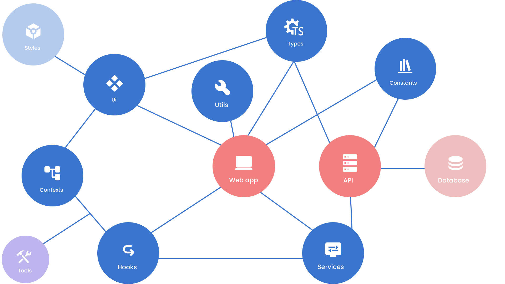

# Travel tailor

[](https://www.typescriptlang.org/docs/)
[]()
[]()
[](https://swagger.io/)

[](https://www.typescriptlang.org/docs/)
[](https://nextjs.org/)
[](https://amzn.github.io/style-dictionary/#/)

[](https://www.docker.com/)
[](https://vercel.com/)
[](https://vitejs.dev/)
[](https://pnpm.io/fr/)
[](https://prettier.io/)
[](https://amzn.github.io/style-dictionary/#/)

<br/>

### Project structure


<br/>

This project use multiple internal libs and apps. all are orgnaized in two folders at the PNPM workspace root (apps & packages).

```bash
- apps
| - api
| - client
- packages
| - constants
| - contexts
| - functions
| - hooks
| - services
| - styles
| - types
| - ui
```

<br/>

### .env example
- API env var
    ```bash
    API_PORT =
    ADMINER_PORT =
    CLIENT_APP_URL =
    API_URL =
    JWT_SECRET =
    POSTGRESQL_DATABASE_TYPE =
    POSTGRESQL_DATABASE_HOST =
    POSTGRESQL_DATABASE_PORT =
    POSTGRESQL_DATABASE_NAME =
    POSTGRESQL_DATABASE_USERNAME =
    POSTGRESQL_DATABASE_PASSWORD =
    MAILDEV_PORT =
    ```
- Client env var
    ```bash
    NEXT_PUBLIC_API_URL =
    ```
<br/>

### API makefile
```bash
.PHONY: up
up:
	docker-compose up -d

.PHONY: down
down:
	docker-compose down

.PHONY: install
install:
	npm install

.PHONY: reset
reset:
	docker volume rm $$(docker volume ls -q) && docker rmi $$(docker images -q)

.PHONY: resetf
resetf:
	docker stop $$(docker ps -a -q) \
	&& docker rm $$(docker ps -a -q) \
	&& docker rmi $$(docker images -q) \
	&& docker volume rm $$(docker volume ls -q) \
	&& docker system prune -a -f

.PHONY: dev
dev: 
	npm run start:dev

.PHONY: init
init: up install dev
```

<br/>

## Run project

install dependancies
```bash
pnpm i
```

run project in parallel
```bash
pnpm -r --parallel run dev
```

run project individualy

pnpm
```bash
pnpm --filter api run dev 
pnpm --filter client run dev 
```
npm
```bash
cd apps/api && npm run dev
cd apps/client && npm run dev
```
<br/>

## Build project
-  build client web app

    pnpm
    ```bash
    pnpm --filter client run build
    ```

    npm
    ```bash
    cd apps/client && npm run build
    ```
    <br/>

-  build api

    pnpm
    ```bash
    pnpm --filter api run build
    ```

    npm
    ```bash
    cd apps/api && npm run build
    ```

-  build UI lib

    pnpm
    ```bash
    pnpm --filter ui run build
    ```

    npm
    ```bash
    cd packages/ui && npm run build
    ```

    <br/>

## Deployed environements

- [API](https://travel-tailor-api.vercel.app/api/v1/doc)
- [Client](https://travel-tailor-client.vercel.app/)

<br/>

## Class diagram
- [Class diagram](https://dbdiagram.io/d/637e1c76c9abfc611174bd92)