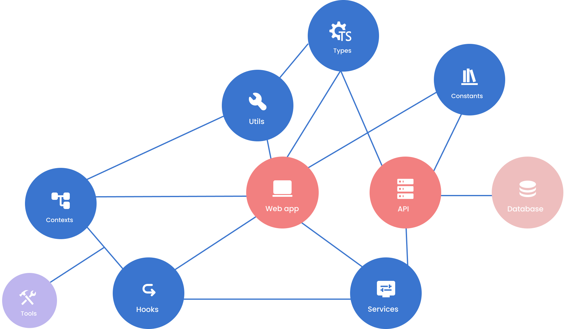

# Travel tailor

[](https://www.typescriptlang.org/docs/)
[]()
[]()

[](https://www.typescriptlang.org/docs/)
[](https://nextjs.org/)
[](https://sass-lang.com/)

[](https://www.docker.com/)
[](https://vercel.com/)

<br/>

## Lib Schema


<br/>

## .env example
```bash
API_PORT =
ADMINER_PORT =
CLIENT_APP_URL =
API_URL =
JWT_SECRET =
POSTGRESQL_DATABASE_TYPE =
POSTGRESQL_DATABASE_HOST =
POSTGRESQL_DATABASE_PORT =
POSTGRESQL_DATABASE_NAME =
POSTGRESQL_DATABASE_USERNAME =
POSTGRESQL_DATABASE_PASSWORD =
MAILDEV_PORT =
```

run project 
```bash
pnpm -r --parallel run dev
```

## Deployed environements

- [API](https://travel-manager-api.vercel.app/api/v1)
- [Client](https://travel-manager-client.vercel.app/)
